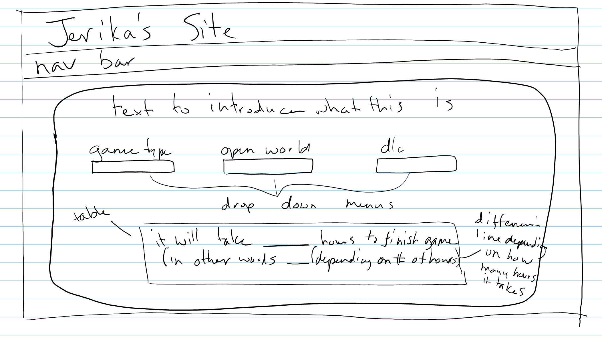
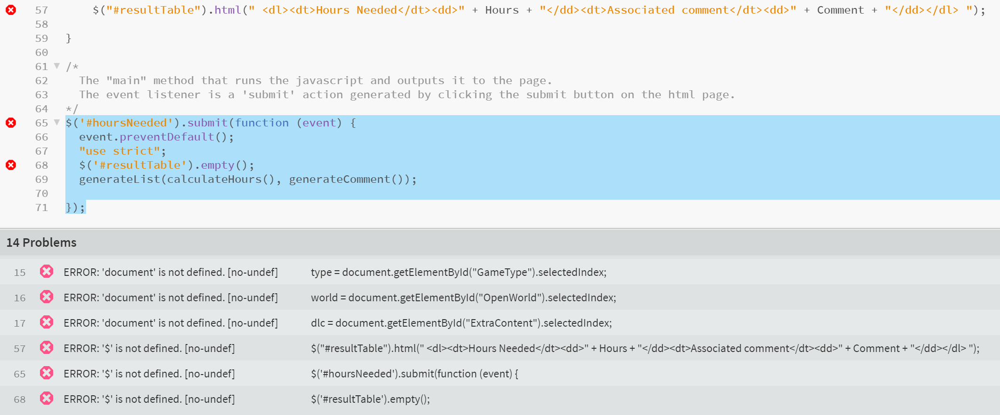

# Homework 2

[Repository](https://github.com/jhammett15/jhammett15.github.io) | [Demo](https://jhammett15.github.io/HWK2/HoursNeeded.html)

In homework 2 we took what we did from Homework 1 and added javascript. We needed to create a webpage with css (either adding to the one from HWK1 or creating a new one) and have jquery (a library of javascript) modify the page based on user input. 

## Planning & Design

I decided to add a page onto my website from Homework 1. This way I already had the css styling and a theme for what the web page should do. For the content, I decided on a "calculator" that would tell approximately how many hours it would take to complete a game according to what type of game it was, whether it was open world or not, and whether it had any DLC.

I figured it would look something like this.



I also did a bit of planning on how I would do the calculations and wrote down the values so I would remember them. 

For the branching requirement of this assignment I decided that I would create all the files I needed: the file for the HTML, the file for the javascript, and the md file for the journal page and push them. I would then create a branch (which I called HW2js) on which I would edit the HTML and javascript file, and would make the journal page on the master branch. This way I could be assured all of my test work was done on the branch, but I would also have some commits on the master to make sure they were kept separate.

## HTML

I created a file called HoursNeeded.html for this. The instructions called for an index.html file but I took the naming as more of a suggestion. I wanted to stick with the theme of my website and have the page named appropriately for what was on it. 

This page satisfied the requirements of HTML, Bootstrap, form elements.

My form had three dropdown menus and a button in it. I'm not sure if this counds as multiple form elements since it was the same form element three times, but it was what I did.

```html
<div class="pagebackground">
    <div class="container">
        <div class="content">
            <p class="text-center">I am an avid completionist, so depending on the type of game the time needed to complete it will vary. Here's how to calculate it... roughly.</p>

            <form id="hoursNeeded">
                <div class="form-group row">
                    <label>Game Type</label>
                    <div class="col">
                        <select id = "GameType" class="dropdown">
                            <option value="0">World Builder</option>
                            <option value="1">RPG</option>
                            <option value="2">Survival</option>
                            <option value="3">Platformer</option>
                        </select>
                    </div>
                </div>
                <div class="form-group row">
                    <label>Open World</label>
                    <div class="col">
                        <select id = "OpenWorld" class="dropdown">
                            <option value="0">Yes</option>
                            <option value="1">No</option>
                        </select>
                    </div>
                </div>
                <div class="form-group row">
                    <label>DLC</label>
                    <div class="col">
                        <select id = "ExtraContent" class="dropdown">
                            <option value="0">Yes</option>
                            <option value="1">No</option>
                        </select>
                    </div>
                </div>
                <div class="form-group row">
                    <div class="col">
                        <p></p>
                        <button type="submit" onclick="">Submit</button>
                    </div>
                </div>
            </form>

            <div class="row">
                <div id="resultTable">
                    <p></p>
                    <!-- Area where the table generated by the JS will go -->
                </div>
            </div>
        </div>
    </div>
</div>
```

## Javascript/jquery

On my javascript page I met the requirements of adding elements to the page and cynamically creating a list.

My javascript file has three functions:
The first function is called calculateHours. It gets the index of the selected option on the drop down menu, and depending on its value assigns variables a certain value. It then takes those newly assigned variables and uses them to calculate the "total number of hours required to complete a video game".

```javascript
function calculateHours() {
    "use strict";
    
    var type, world, dlc, hours, multiplier, addition, totalHours;
    
    type = document.getElementById("GameType").selectedIndex;
    world = document.getElementById("OpenWorld").selectedIndex;
    dlc = document.getElementById("ExtraContent").selectedIndex;
    
    if (type === 0) { hours = 1000; }
    if (type === 1) { hours = 150; }
    if (type === 2) { hours = 300; }
    if (type === 3) { hours = 100; }
    
    if (world === 0) { multiplier = 3; }
    if (world === 1) { multiplier = 1; }
    
    if (dlc === 0) { addition = 80; }
    if (dlc === 1) { addition = 0; }
        
    totalHours = hours * multiplier + addition;
    return totalHours;
}
```

My next function takes the total number of hours calculated from the first function and generates a (not so) witty comment according to how many hours it took.

```javascript
function generateComment() {
    "use strict";
    var comment, hours = calculateHours();
    
    if (hours < 150) { comment = "Well that should take no time at all!"; }
    if (hours >= 150 && hours <= 300) { comment = "A decently sized game it apperas."; }
    if (hours > 300 && hours < 500) { comment = "Well that should take a while."; }
    if (hours > 500 && hours < 1000) { comment = "Ok, that's getting excessive."; }
    if (hours > 1000) { comment = "You'll never finish this game! Muahahaha!"; }
    
    
    return comment;
}
```

The last function takes in the total number of hours and the comment (generated from the two above methods) and puts the results in an HTML description list that will be displayed in the div with the id "resultTable" located below the form.

```javascript
function generateList(Hours, Comment) {
    "use strict";
    
    $("#resultTable").html(" <dl><dt>Hours Needed</dt><dd>" + Hours + "</dd><dt>Associated comment</dt><dd>" + Comment + "</dd></dl> ");
    
}
```

After that the last thing to do was generate an event upon the button click that would take the inputs, have the javascript do its thing on them, and return the list.

```javascript
$('#hoursNeeded').submit(function (event) {
  event.preventDefault();
  "use strict";
  $('#resultTable').empty();
  generateList(calculateHours(), generateComment());
    
});
```

## Issues

The main issue I had with this project was actually with my editor it seems. I was using brackets, and every time I put in a $ to signify that I was using jquery it would say there was an error. That $ was not defined.



Because these errors disappeared when I took the dollar signs out, for the longest time I was not including them. When I reached the end of my javascript file and tried to actually generate the list, nothing was happening. After some searching I realized that this problem was down to the dollar signs that I took out, so I tried putting a few back in, but only at the end of the document. It gave the same result, which I took to mean that my files were not recognizing the javascript for whatever reason. I tried putting the script tags in the head, at the bottom of the body, googling different scripts to use, nothing was working. Eventually with Scot's help I put the script tags at the bottom of the body, and made sure that the missing $ were but EVERYWHERE they should be, which in retrospect seems like an obvious fix. Things were then working and I could see the other minor bug fixes I needed to make.


