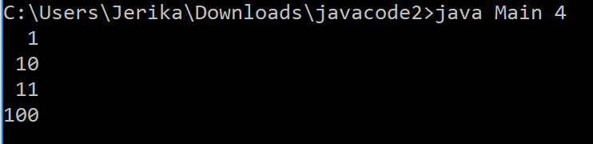
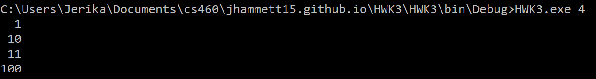
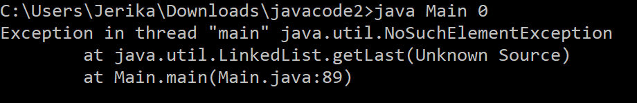
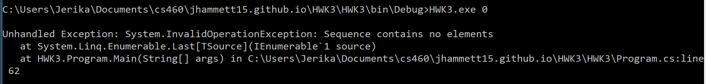
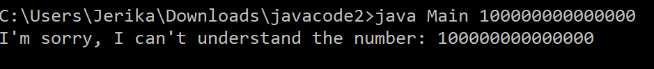
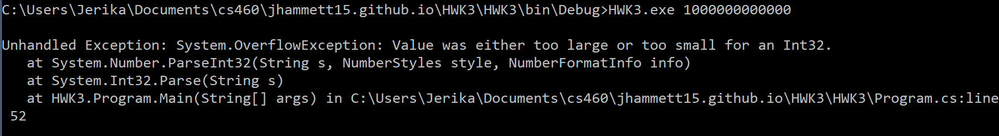

# Homework 3

[Repository](https://github.com/jhammett15/jhammett15.github.io) 

The task for Homework 3 was to translate a program from Java to C#. This program was a binary number generator. It took in an integer greater than one in decimal and output a list of binary numbers from one up to that number. We were to do this in Microsoft Visual Studio. I had used neither this nor C# before.

## Download Visual Studio

You can download Visual Studio [here](https://visualstudio.microsoft.com/). It was a bit intimidating at first because there were so many buttons. Figuring out which kind of project I needed to create in the first place was probably the most difficult part. Once that was done it was fairly easy, Visual Studio autogenerates the basic starting code that you need. 

## Translating the Node class

The Node class was very straightforward to translate, the syntax for C# and Java matched up exactly, the only differences in the files is the using statements at the top of the C# file, and the naming conventions. In C#, field names are capitalized whereas in Java they aren't. 

Java code:
```java
public class Node<T>
{
	public T data;
	public Node<T> next;
	
	public Node( T data, Node<T> next )
	{
		this.data = data;
		this.next = next;
	}
}
```

C# code:
```C#
using System;
using System.Collections.Generic;
using System.Linq;
using System.Text;
using System.Threading.Tasks;

namespace HWK3
{
    /// <summary>
    /// Singly linked node class
    /// </summary>
    /// <typeparam name="T">specifies that the Node will be of a generic type</typeparam>
    class Node<T>
    {
        public T Data;
        public Node<T> Next;

        /// <summary>
        /// Creates a Node with two fields
        /// </summary>
        /// <param name="data">the contents of the Node</param>
        /// <param name="next">a pointer to the next Node</param>
        public Node(T data, Node<T> next)
        {
            this.Data = data;
            this.Next = next;
        }
    }
}
```

## Translating the QueueInterface class

Again, the differences between Java and C# in the QueueInterface class were minimal. Convention says the method names, so I capitalized Push, Pop and IsEmpty. The other difference was the throws clause. C# doesn't have checked exceptions like Java does, all of its exception handling is done in try/catch blocks. Therefore the throws QueueUnderflowException clause in the Pop method was omitted.

Java code:
```java
public interface QueueInterface<T>
{
    /**
     * Add an element to the rear of the queue
     * 
     * @return the element that was enqueued
     */
    T push(T element);

    /**
     * Remove and return the front element.
     * 
     * @throws Thrown if the queue is empty
     */
    T pop() throws QueueUnderflowException;

    /**
     * Test if the queue is empty
     * 
     * @return true if the queue is empty; otherwise false
     */
    boolean isEmpty();
}
```

C# code:
```C#
using System;
using System.Collections.Generic;
using System.Linq;
using System.Text;
using System.Threading.Tasks;

namespace HWK3
{
    /// <summary>
    /// A FIFO queue interface. This is suitable for a singly linked queue
    /// </summary>
    /// <typeparam name="T">Specifies that the Queue that inherits from this will take in a generic type</typeparam>
    public interface IQueue<T>
    {
        /// <summary>
        /// adds an element to the rear of the queue
        /// </summary>
        /// <param name="element">the item to be enqueued</param>
        /// <returns>returns the element that was enqueued</returns>
        T Push(T element);

        /// <summary>
        /// removes and returns the front element
        /// exception thrown if the queue is empty
        /// </summary>
        /// <returns>the element taht was at the front of the queue</returns>
        T Pop();

        /// <summary>
        /// test if the queue is empty
        /// </summary>
        /// <returns>teturn true if the queue is empty, otherwise false</returns>
        bool IsEmpty();
    }
}

```

## Translating the QueueUnderflowException class

This class was a little more complicated to translate. C# has no equivalent to Java's RuntimeException class, which the QueueUnderflowException java class extends. Instead, the C# file needed to inherit from C#'s SystemExeption class, which syntactically was done with a colon. Furthermore, the java class calls to the constructors of its superclass. This meant that in order to find out what was happening, I had to look up the documentation for RuntimeException in order to simulate it. The source code for Java's RuntimeException class can be found [here](http://developer.classpath.org/doc/java/lang/RuntimeException-source.html). What I saw there was that the default constructor was empty. Thus for my C# file I left the default constructor empty. This way it will return null. The constructor with the String parameter was a little trickier.  The RuntimeException version of this method called its super class's constructor (Exception), which in turn called its super class's constructor (Throwable). I found the source code I needed [here](http://developer.classpath.org/doc/java/lang/Throwable-source.html). What I found was that it called the fillInStackTrace() method, which prints out the stack trace up to the point of the exception, and prints out the message that was passed in to the console. Therefore, in my QueueUnderflowException C# file, I used a Console.WriteLine to print the message to the screen, then used another Console.WriteLine to print the stack trace, which I found using Environment.StackTrace.

Java code:
```java
public class QueueUnderflowException extends RuntimeException
{
  public QueueUnderflowException()
  {
    super();
  }

  public QueueUnderflowException(String message)
  {
    super(message);
  }
}
```

C# code:
```C#
using System;
using System.Collections.Generic;
using System.Linq;
using System.Text;
using System.Threading.Tasks;

namespace HWK3
{
    /// <summary>
    /// A custom unchecked exception to represent situations where 
    /// an illegal operation was performed on an empty queue.
    /// </summary>
    public class QueueUnderflowException : SystemException
    {
        /// <summary>
        /// empty constructor, creates an exception without a message
        /// </summary>
        public QueueUnderflowException()
        {
        }

        /// <summary>
        /// prints out the message taken in then the stacktrace
        /// </summary>
        /// <param name="message">the message to be printed out when the exception is thrown</param>
        public QueueUnderflowException(string message)
        {
            Console.WriteLine(message);
            Console.WriteLine(Environment.StackTrace);
        }
    }
}

```

## Translating the LinkedQueue class

The differences between the Java LinkedQueue file and the one written in C# were all syntactical. Naming conventions once again stated that fiend and method names were to be capitalized. Implementing an interface in C# is done as a colon followed by the name of the interface rather than an implements clause. C#'s equivalent to Java's NullPointerException class is called NullReferenceException.  The only other syntactical difference was that C# does not have an else if clause. Therefore, you just put another if/else statement inside the else clause of the first. I did run into one issue with this class in the Pop method when I initially tried to set tmp to null. It gave an error saying that it could not convert a null type to parameter T because it could be a non-nullable value type. How I ended up solving this was I did not assign tmp an initial value.

Java code:
```java
public class LinkedQueue<T> implements QueueInterface<T>
{
	private Node<T> front;
	private Node<T> rear;

	public LinkedQueue()
	{
		front = null;
		rear = null;
	}

	public T push(T element)
	{ 
		if( element == null )
		{
			throw new NullPointerException();
		}
		
		if( isEmpty() )
		{
			Node<T> tmp = new Node<T>( element, null );
			rear = front = tmp;
		}
		else
		{		
			// General case
			Node<T> tmp = new Node<T>( element, null );
			rear.next = tmp;
			rear = tmp;
        }
        return element;
	}     

	public T pop()
	{
		T tmp = null;
		if( isEmpty() )
		{
			throw new QueueUnderflowException("The queue was empty when pop was invoked.");
		}
		else if( front == rear )
		{	// one item in queue
			tmp = front.data;
			front = null;
			rear = null;
		}
		else
		{
			// General case
			tmp = front.data;
			front = front.next;
		}
		
		return tmp;
	}

	public boolean isEmpty()
	{              
		if( front == null && rear == null )
		{
			return true;
		}
		else
		{
			return false;
		}
	}
}

```

C# code:
```C#
using System;
using System.Collections.Generic;
using System.Linq;
using System.Text;
using System.Threading.Tasks;

namespace HWK3
{ 
    /// <summary>
    /// A singly linked FIFO Queue.
    /// </summary>
    /// <typeparam name="T">This LinkedQueue will be created with a generic type.</typeparam>
    public class LinkedQueue<T> : IQueue<T>
    {
        private Node<T> Front;
        private Node<T> Rear;

        public LinkedQueue()
        {
            Front = null;
            Rear = null;
        }

        /// <summary>
        /// Adds a Node element to the end of the LinkedQueue
        /// If the element passed in is null, throws a NullReferenceException.
        /// If the LinkedQueue is currently empty, adds the element to the list and sets the 
        /// Front and Rear fields to the element.
        /// </summary>
        /// <param name="element">the Node element to be added to the LinkedQueue</param>
        /// <returns>returns the element that was enqueued</returns>
        public T Push(T element)
        {
            if(element == null)
            {
                throw new NullReferenceException();
            }
            if(IsEmpty())
            {
                Node<T> tmp = new Node<T>(element, null);
                Rear = Front = tmp;
            }
            else
            {
                // general case
                Node<T> tmp = new Node<T>(element, null);
                Rear.Next = tmp;
                Rear = tmp;
            }
            return element;
        }

        /// <summary>
        /// "Pops" the first item off the front of the LinkedQueue, then sets the Front field to be 
        /// the next element in the queue. 
        /// If the queue is empty, throw a QueueUnderflowException.
        /// If there is only one element in the list, pop it and set the Front and 
        /// Rear fields to null
        /// </summary>
        /// <returns>returns the element from the front of the LinkedQueue</returns>
        public T Pop()
        {
            T tmp;
            if(IsEmpty())
            {
                throw new QueueUnderflowException("The queue was empty when Pop was invoked");
            }
            else
            {
                if(Front == Rear)
                {
                    tmp = Front.Data;
                    Front = null;
                    Rear = null;
                }
                else
                {
                    tmp = Front.Data;
                    Front = Front.Next;
                }
            }
            return tmp;
        }

        /// <summary>
        /// Checks to see if the LinkedQueue is empty or not.
        /// </summary>
        /// <returns>returns true if the queue is empty, returns false if it isn't</returns>
        public bool IsEmpty()
        {
            if(Front == null && Rear == null)
            {
                return true;
            }
            else
            {
                return false;
            }
        }
    }
}

```

## Translating the Main class

Again, these two classes were very similar, they just had minor differences in method and class names. Convention in C# says that the string class should not be capitalized. C#'s equivalent to Java's add method in the LinkedList class was AddLast. getLast() became just Last(). Java's Integer.parseInt() method in the Main method was equivalent to C#'s int.Parse(). The method in C# to return the length of a string is called without parentheses. C# has a dedicated foreach loop rather than just extending the syntax of the for loop. The only other different was in the NumberFormatEXception class in Java behaved slightly differently to C#'s FormatException class I believe. In the Java file when the exception was thrown, it printed out a message to the console. In my C# file, it just printed out the stack trace. I never quite got this figured out.

Java code:
```java
import java.util.LinkedList; 

public class Main  
{ 
    static LinkedList<String> generateBinaryRepresentationList(int n) 
    { 
        // Create an empty queue of strings with which to perform the traversal
        LinkedQueue<StringBuilder> q = new LinkedQueue<StringBuilder>(); 

        // A list for returning the binary values
        LinkedList<String> output = new LinkedList<String>();
        
        if(n < 1)
        {
            // binary representation of negative values is not supported
            // return an empty list
            return output;
        }
          
        // Enqueue the first binary number.  Use a dynamic string to avoid string concat
        q.push(new StringBuilder("1")); 
          
        // BFS 
        while(n-- > 0) 
        { 
            // print the front of queue 
            StringBuilder sb = q.pop(); 
            output.add(sb.toString()); 
            
            // Make a copy
            StringBuilder sbc = new StringBuilder(sb.toString());

            // Left child
            sb.append('0');
            q.push(sb);
            // Right child
            sbc.append('1');
            q.push(sbc); 
        }
        return output;
    } 
      
    // Driver program to test above function 
    public static void main(String[] args)  
    { 
        int n = 10;
        if(args.length < 1)
        {
            System.out.println("Please invoke with the max value to print binary up to, like this:");
            System.out.println("\tjava Main 12");
            return;
        }
        try 
        {
            n = Integer.parseInt(args[0]);
        } 
        catch (NumberFormatException e) 
        {
            System.out.println("I'm sorry, I can't understand the number: " + args[0]);
            return;
        }
        LinkedList<String> output = generateBinaryRepresentationList(n);
        // Print it right justified.  Longest string is the last one.
        // Print enough spaces to move it over the correct distance
        int maxLength = output.getLast().length();
        for(String s : output)
        {
            for(int i = 0; i < maxLength - s.length(); ++i)
            {
                System.out.print(" ");
            }
            System.out.println(s);
        }
    } 
} 
```

C# code:
```C#
using System;
using System.Collections.Generic;
using System.Linq;
using System.Text;
using System.Threading.Tasks;

namespace HWK3
{
    /// <summary>
    /// This simple example demonstrates the rather powerful
    /// application of Breadth-First Search to enumeration of states problems.
    /// 
    /// There are easier ways to generate a list of binary values, but this technique
    /// is very general and a good one to remember for other uses.
    /// </summary>
    class Program
    {
        /// <summary> 
        /// Print the binary representation of all numbers from 1 up to n.
        /// This is accomplished by using a FIFO queue to perform a level order (breadth first search)
        /// traversal of a virtual binary tree and then storing each "value" in a list as it is "visited"
        /// </summary>
        /// <param name="n">the decimal number we will be creating a binary representation for</param>
        /// <returns>the list of the binary values</returns>
        static LinkedList<string> GenerateBinaryRepresentation(int n)
        {
            // create an empty queue of strings with which to perform the traversal
            LinkedQueue<StringBuilder> q = new LinkedQueue<StringBuilder>();

            // a list for returning the binary values
            LinkedList<string> output = new LinkedList<string>();

            if(n < 1)
            {
                // binary representation of negative values is not supported
                // return an empty list
                return output;
            }

            // enqueue the first binary number
            // use a dynamic string to avoid string concat
            q.Push(new StringBuilder("1"));

            // breadth first search
            while(n-- > 0)
            {
                // print the front of the queue
                StringBuilder sb = q.Pop();
                output.AddLast(sb.ToString());

                // make a copy
                StringBuilder sbc = new StringBuilder(sb.ToString());

                // left child
                sb.Append("0");
                q.Push(sb);

                // right child
                sbc.Append("1");
                q.Push(sbc);
            }

            return output;
        }

        /// <summary>
        /// The driver program to test the above function
        /// </summary>
        /// <param name="args">the argument taken in from the command line, the number to be converted into binary</param>
        static void Main(string[] args)
        {
            int n = 10;
            if(args.Length < 1)
            {
                Console.WriteLine("Please invoke with the max value to print binary up to, like this:");
                Console.WriteLine("HWK3.exe 12");
                return;
            }
            try
            {
                n = int.Parse(args[0]);
            }
            catch(FormatException)
            {
                Console.WriteLine("I'm sorry, I can't understand the number: " + args[0]);
                return;
            }

            LinkedList<string> output = GenerateBinaryRepresentation(n);

            // print it right justified, longest string is the last one
            // print enough spaces to move it over the correct distance
            int maxLength = output.Last().Length;
            foreach(string s in output)
            {
                for(int i = 0; i < maxLength - s.Length; i++)
                {
                    Console.Write(" ");
                }
                Console.WriteLine(s);
            }
        }
    }
}
```

## Results

In the end the results were mostly the same as the Java program. When the program was run as intended, they were the same.

Java:


C#:


They also both threw error messages, albeit different ones when given a parameter of less than 1.

Java:


C#:


Where they differed was in the Main method where they were given a larger larger than an int that threw a NumberFormatException (Java) or a FormatException (C#). In the Java file, it worked as intended, it displayed the message it was supposed to. In the C# file, it simply gave an error message and a stack trace.

Java:


C#:
