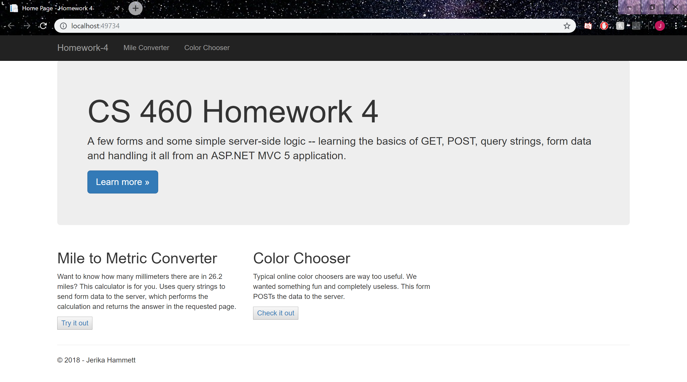
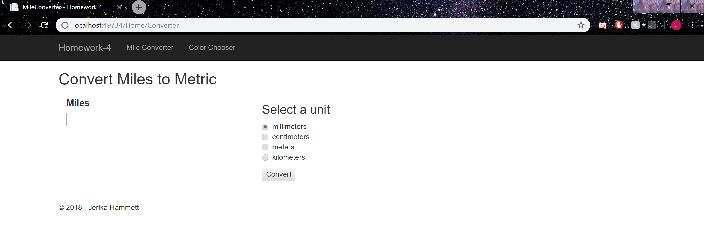
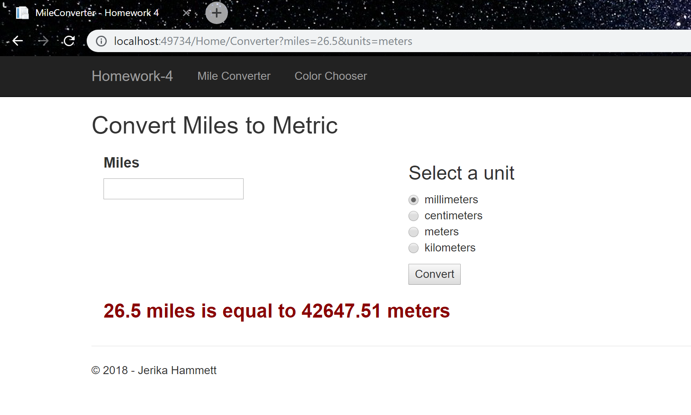
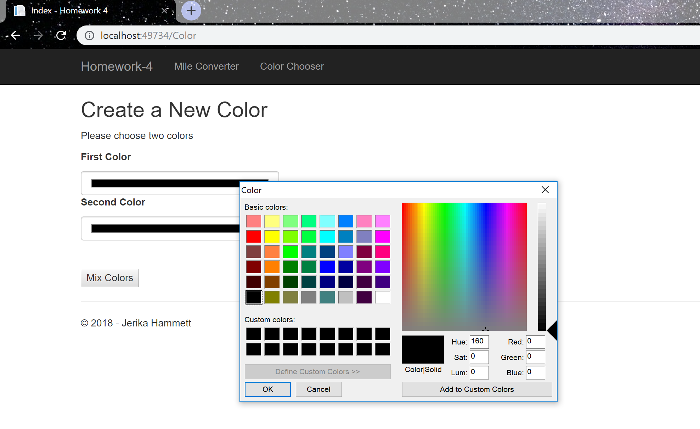
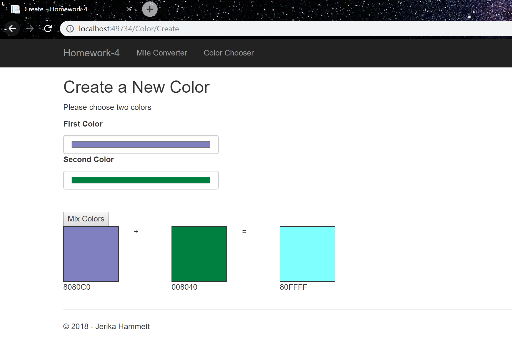

# Homework 4

[Repository](https://github.com/jhammett15/jhammett15.github.io) 

The task for homework 4 was to create an MVC project to demonstrate simple server-side logic. We demonstrated the basics of GET and POST commands, as well as query strings, form data, and input validation. We did this through the creation of two pages: a mile converter which took in a mile number and converted it to one of many other measurements, and a color chooser which took in two colors and added their hexadecimal values together and displayed a third color.

## Setup

The first step was to create an empty MVC project. Prior to starting this homework I had gone through the first few chapters of the Pro ASP.NET MVC 5 book so I already had an idea on how to do this and where to look for things. The instrucions given in class were also very helpful, so I didn't have much issue with the setup of this project.

## Planning

I created two branches in git for this project: a mileconverter branch and a colorchooser branch. I was already familiar with the idea of switching between branches and isolating the work so all the work for the Color Chooser was don only on the colorchooser branch for example. I would work on a branch, commit it, and then switch to another branch and work on that. One thing I had forgotten to do until I was done with the mile converter and half-way done with the color chooser however was to push the various branches to github. This was a bad idea and will not be happening again. Once everything was done, I merged the two branches into Master. The mileconverter branch I merged first with no problem. When I merged the colorchooser branch I had merge conflicts in several of my files. These were easily fixed however simply by going into the file. When git told me there were merge conflicts it put both versions of what was conflicting side by side in each file so all I had to do was go in and choose which one I wanted.

## Content/Coding

The first thing I did was create the pages I was going to need. In the HomeController I added an ActionResult method to do the mile conversion and created a View based on that. Then I created a ColorController and gave it Index and Create ActionResult methods, and created Views based on those. The next thing I did was create a blank blog page. The last thing I did on Master before creating my branches was to delete the default pages I wasn't going to use and go into the Layout.cshtml page and change the links in the navbar so that they pointed to my pages.

```html
<div class="navbar navbar-inverse navbar-fixed-top">
        <div class="container">
            <div class="navbar-header">
                <button type="button" class="navbar-toggle" data-toggle="collapse" data-target=".navbar-collapse">
                    <span class="icon-bar"></span>
                    <span class="icon-bar"></span>
                    <span class="icon-bar"></span>
                </button>
                @Html.ActionLink("Homework-4", "Index", "Home", new { area = "" }, new { @class = "navbar-brand" })
            </div>
            <div class="navbar-collapse collapse">
                <ul class="nav navbar-nav">
                    <li>@Html.ActionLink("Mile Converter", "Converter", "Home")</li>
                    <li>@Html.ActionLink("Color Chooser", "Index", "Color")</li>
                </ul>
            </div>
        </div>
    </div>
```

I also did minor changes like change the title of the pages and put my name on the footer.

## Home Index View



After creating the branches I first switched to the mileconverter branch where I completed the HomeController's Index page (the landing site for the project), and the mile converter. The Index View was very straightforward and did not require much changing. I simply changed the descriptions to match what my pages were about, then changed the links to the buttons.

```html
@{
    ViewBag.Title = "Home Page";
}

<!--A View for the home page, contains a description of the project, as well as a link to the project directions page. Below that there is 
    a description of each page as well as a button linking to them.-->
<div class="jumbotron">
    <h1>CS 460 Homework 4</h1>
    <p class="lead">
        A few forms and some simple server-side logic -- learning the basics of GET, POST, query strings, form data and 
        handling it all from an ASP.NET MVC 5 application.</p>
    <p><a href="http://www.wou.edu/~morses/classes/cs46x/assignments/HW4_1819.html" class="btn btn-primary btn-lg">Learn more &raquo;</a></p>
</div>

<div class="row">
    <div class="col-md-4">
        <h2>Mile to Metric Converter</h2>
        <p>
            Want to know how many millimeters there are in 26.2 miles? This calculator is for you. Uses query strings to send form data to
            the server, which performs the calculation and returns the answer in the requested page.
        </p>
        <p><button type="button">@Html.ActionLink("Try it out", "MileConverter")</button></p>        
    </div>
    <div class="col-md-4">
        <h2>Color Chooser</h2>
        <p>
            Typical online color choosers are way too useful. We wanted something fun and completely useless. This form POSTs the data to the
            server.
        </p>
        <p><button type="button">@Html.ActionLink("Check it out", "Create", "Color")</button></p>
    </div>
</div>
```

## Converter View



The next thing I worked on, although I didn't finish it until after I completed the Home Controller, was the Converter View. This file created a form whose method was get that took in input from the user and put it into a query string. The first input field was a simple text box that the user put the number of miles in. This was fairly simple but it needed some input validation. First I added the type attribute, which limited what the user could type in to numbers. Then I added the min tag to set the minimum number of miles to 0, and put a required tag in so they were sure to fill it out. The only other thing of note in this element was the step attribute, which allows the user to put doubles as well as integers in.

The next input field was a div in which I put a bunch of radio buttons for the units to be selected from. I set their name to units so I could reference them in the HomeController and their value to whatever their measurement was so it would appear as so in the query string. I then added a div with a razor statement at the bottom. I checked to see if the ViewBag.measurement field was null. If it was null, that meant that the query string was empty and no input had been submitted yet. If it was not null, it got the result string that the HomeController generated and appended it to the bottom of the screen.



```html
@{
    ViewBag.Title = "Converter";
}

<h2>Convert Miles to Metric</h2>

<!--The View of the Mile Converter page. Creates a form that takes in the number of miles from a user in an input box and the conversion 
    type in a radio button group, then if the ViewBag.measurement variable is not null, meaning that they have hit the submit button, it 
    returns a string with the conversion.-->
<form action="/Home/Converter" method="get">
    <div class="container-fluid">
        <div class="content">
            <div class="row">
                <div class="col-md-4">
                    <h4><strong>Miles</strong></h4>
                    <!--An input field to take in the number of miles. Validates that there was input, that it was above zero, and that it 
                        was a number entered.-->
                    <input id="miles" type="number" name="miles" min="0" step="any" required/>
                </div>
                <div class="col-md-4">
                    <h3>Select a unit</h3>
                    <!--A radio button group for the type of units, the default value checked is millimeters.-->
                    <div class="radio">
                        <label><input type="radio" name="units" value="millimeters" checked/>millimeters</label> <br />
                        <label><input type="radio" name="units" value="centimeters"/>centimeters</label> <br />
                        <label><input type="radio" name="units" value="meters"/>meters</label> <br />
                        <label><input type="radio" name="units" value="kilometers"/>kilometers</label> <br />
                    </div>
                    <input type="submit" value="Convert"/>
                </div>                
            </div>
            <div class="row">
                <div class="col-md-6">
                    <!--If the ViewBag.measurement variable is not null, meaning that the user has entered input and hit submit, then convert
                        the miles into the designated units and return a string with the result.-->
                    <div>
                        @if (ViewBag.measurement != null)
                        {
                            <p><h3 id="milesConverted"><strong>@ViewBag.result</strong></h3></p>
                        }
                    </div>
                </div>
            </div>
        </div>        
    </div> 
</form>
```

## Home Controller

On the HomeController Page there was already an existing ActionResult method for the View for the Index, I just needed to create the View itself. As for the methods I had to add to this controller, the only one I needed to add was a Converter method, and create its corresponding View. 

The Converter method is an HttpGet method that uses Request.QueryString to retrieve information from the query string that is generated in the URL when the user hits the submit button on their input. It retrieved the mile string (which it then converted into a double) and the units string. Then it performed a calculation on the mile number depending on the unit it retrieved. Finally, it created a string to return this information in and added this string to the ViewBag if the input it retrieved from the user was not null (meaning there was input to be retrieved).

```C#
public class HomeController : Controller
    {
        private double? mi;
        private string measurement;
        private string result;

        /// <summary>
        /// A Controller method that generates the "Home" or "Index" page of the project
        /// </summary>
        /// <returns>The View for the Index page.</returns>
        public ActionResult Index()
        {
            return View();
        }

        /// <summary>
        /// A Controller method that retrieves a double representing the number of miles and a string representing the measurement to be 
        /// converted to from the View via a GET method. It then converts the miles, storing the result in a new variable. Finally it checks 
        /// so see if the measurement variable is not null. If it is null, this means that the input has not been submitted yet. If it is 
        /// not null, the input has ben submitted and it stores the measurement variable and result of the conversion in a ViewBag.
        /// </summary>
        /// <returns>The View for the Mile Converter page</returns>
        [HttpGet]
        public ActionResult Converter()
        {
            Debug.WriteLine(Request.QueryString["miles"]);
            Debug.WriteLine(Request.QueryString["units"]);

            mi = Convert.ToDouble(Request.QueryString["miles"]);
            measurement = Request.QueryString["units"];
            double? total;

            if(measurement == "millimeters")
            {
                total = mi * 1609.34 * 1000;
            }
            else
            {
                if(measurement == "centimeters")
                {
                    total = mi * 1609.34 * 100;
                }
                else
                {
                    if(measurement == "meters")
                    {
                        total = mi * 1609.34;
                    }
                    else
                    {
                        total = mi * 1.60934;
                    }
                }
            }

            result = mi + " miles is equal to " + total + " " + measurement;

            Debug.WriteLine(total);
            Debug.WriteLine(result);

            if (measurement != null)
            {
                ViewBag.measurement = measurement;
                ViewBag.result = result;
            }

            return View();
        }       
    }
```

After I was done with the mile converter I switched to the colorchooser branch.

## Color Index View

The first thing I did on this branch was complete the Index View for the ColorController. What I needed to do here was create a HttpPost method that took in input in the form of a hexadecimal color from some text boxes and create a button to submit them. I used Html Helper methods for the text boxes, but then I veered slightly from the directions. What I believe they were supposed to be were simple text boxes where the user typed in a hexadecimal string, which I then validated was of the correct form and converted into a color. What I ended up doing was making a TextBox that used a popup box to select an RGB color. This negated the need for input validation, which I liked so I kept. I know it's probably not what was required, and if I have the time later I'll go in and fix it but for now the logic works so I'll leave it be.



```html
@{
    ViewBag.Title = "Index";
}

<h2>Create a New Color</h2>

<p>Please choose two colors</p>

<!-- Creates the form that the user is to choose the colors from -->
<form action="/Color/Create" method="post">
    <!--Labels and HTML helper methods, sets the name to first color, does not give it a default value, and adds html attributes setting the text box to
        be a popup box to choose colors from rather than a regular text box. Also gives it a placeholder value-->
    <p><strong>First Color</strong></p>
    @Html.TextBox("firstColor", null, htmlAttributes: new { @class = "form-control", type = "Color", placeholder = "#178C2A" })
    <p><strong>Second Color</strong></p>
    @Html.TextBox("secondColor", null, htmlAttributes: new { @class = "form-control", type = "Color", placeholder = "B4641D" })
    <br /><br />
    <div class="button">
        <button type="submit">Mix Colors</button>
    </div>
</form>
```

Once this was done I vascillated between the Create View and the ColorController trying to get the logic to work.

## Color Create View

This page is created when input is submitted on the Color Index page. The Index page uses a POST method to send its data to the controller. The action tag in the top of the form tells it to send it to the Create method, which then returns this view. The top of the form looks much the same as the Index page. This is by design so the user can input more colors and see their combination without going back to the Index page.

Below that is a Bootstrap grid containing a bunch of squares. I overrode html's default square class with my own to give me more control.

```css
/* Overrides the square class with my own custom square with a height, width, border, and default background color*/
div.square {
    height: 100px;
    width: 100px;
    border: 1px solid;
    background-color:aliceblue;
}
```

I also input a style tag inside the div that changed the background color of the square based on what was in the ViewBag. This was difficult to figure out but the solution ended up being to use a css tag exactly how I would have in the css file. However, because the value in the ViewBag was a string, not a number, I had to put a # in front of it so the program would recognize it as a hex code. I also probably could have played with the css some more on the + and = in between the squares to make them look nicer but they work. Also, in the process of making sure the ViewBag was returning the right values I printed them out below the squares. This is unnecessary except for debugging purposes but I liked the extra information so I left it in.



```html
@{
    ViewBag.Title = "Create";
}

<h2>Create a New Color</h2>

<p>Please choose two colors</p>

<!-- Creates the form that the user is to choose the colors from, with the addition of squares to demonstrate the addition of the two
    colors visually-->
<form action="/Color/Create" method="post">
    <!--Labels and HTML helper methods, sets the name to first color, does not give it a default value, and adds html attributes setting the text box to
        be a popup box to choose colors from rather than a regular text box. Also gives it a placeholder value-->
    <p><strong>First Color</strong></p>
    @Html.TextBox("firstColor", null, htmlAttributes: new { @class = "form-control", type = "Color", placeholder = "#178C2A" })
    <p><strong>Second Color</strong></p>
    @Html.TextBox("secondColor", null, htmlAttributes: new { @class = "form-control", type = "Color", placeholder = "B4641D" })
    <br /><br />
    <div class="button">
        <button type="submit">Mix Colors</button>
    </div>

    <!--A grid to display the colors visually. Creates the squares using an overriden square class and an inline style tag that sets the 
        color of the square dynamically based on what is returned in the ViewBag-->
    <div class="row">
        <div class="col-sm-1">
            <div class="square" style="background-color:#@ViewBag.color1"></div>
            <p>@ViewBag.color1</p>
        </div>
        <div class="col-sm-1" align="center">
            <p style="text-align: center">+</p>
        </div>
        <div class="col-sm-1">
            <div class="square" style="background-color:#@ViewBag.color2"></div>
            <p>@ViewBag.color2</p>
        </div>
        <div class="col-sm-1" align="center">
            <p style="text-align: center">=</p>
        </div>
        <div class="col-sm-1">
            <div class="square" style="background-color:#@ViewBag.color3"></div>
            <p>@ViewBag.color3</p>
        </div>
    </div>
</form>
```