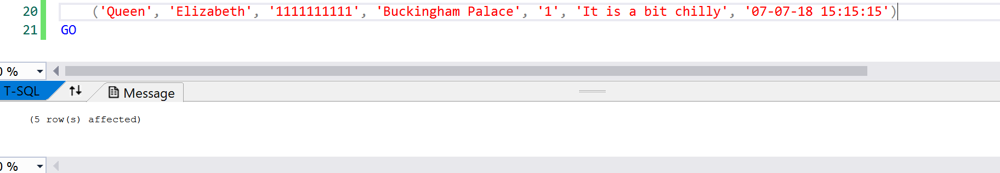
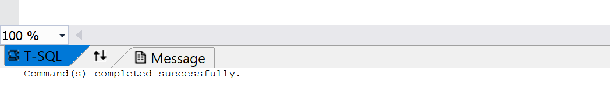

# Homework 5

[Repository](https://github.com/jhammett15/jhammett15.github.io) 

The goal of this homework was to create a database-backed web application using ASP.NET MVC 5. This would take the form of a maintenance request form. To begin with I was to write the T-SQL necessary to create and populate a simple one-table database. The first page would be the request form. The user would fill out the fields and when submitted the data would be stored in a local database. The second part of the project was to create a table populated with the data from this database. I did this through the use of T-SQL

## Creating the database

The first step in the project was to create the database that I would be adding to. This was done solely through an SQL script and VisualStudios. I created two scripts. An Up.sql, which created and seeded the table with default entries:

```sql
-- Requests table
CREATE TABLE [dbo].[Requests]
(
	[ID]			INT IDENTITY (1,1)	NOT NULL,
	[FirstName]		NVARCHAR(64)		NOT NULL,
	[LastName]		NVARCHAR(64)		NOT NULL,
	[PhoneNumber]	NVARCHAR(10)		NOT NULL,
	[ApartmentName]	NVARCHAR(64)		NOT NULL,
	[UnitNumber]	INT					NOT NULL,
	[Explanation]	NVARCHAR(250)		NOT NULL,
	[CurrTime]		DATETIME			NOT NULL	DEFAULT SYSUTCDATETIME(),
	CONSTRAINT [PK_dbo.Requests] PRIMARY KEY CLUSTERED ([ID] ASC)
);

INSERT INTO [dbo].[Requests] (FirstName, LastName, PhoneNumber, ApartmentName, UnitNumber, Explanation, CurrTime) VALUES
	('Jerika', 'Hammett', '5037461948', 'Random Apartments', '14', 'Testing', '2013-06-05 17:00:00'),
	('Bob', 'Marley', '3608372957', 'Random Apartments', '15', 'The kitchen faucet is leaking', '12-12-12 00:00:00'),
	('Susie', 'Susanson', '5837591024', 'Other Apartments', '2', 'There are rats in my apartment', '03-04-05 01:01:01'),
	('Jack', 'Harkness', '6969696969', 'The Tardis', '0', 'I locked myself out.', '12-13-14 08:09:10'),
	('Queen', 'Elizabeth', '1111111111', 'Buckingham Palace', '1', 'It is a bit chilly', '07-07-18 15:15:15')
GO
```

And a Down.sql which cleared the table.

```sql
-- Take the Requests table down
DROP TABLE [dbo].[Requests];
```

Here are images that show the scripts work as intended.

up.sql:


down.sql:


The database I created was called OurRequests, and the Table I created through the SQL above was called Requests. The fields it contained were ID (which was the primary key), FirstName, LastName, PhoneNumber, ApartmentName, UnitNumber, Explanation, and CurrTime. All of these fields were required, so I marked them not null. The CurrTime field had the type DateNime. It could be set, as I did when I seeded the table, but when not set, as when I added to the database through the form, it defaulted to the current time. 

Following the creation of the table is the insert statement where I seeded it. This part is fairly self-explanatory, I just said insert into the table these fields, given the values provided.

## Request Model Class

I next created the Model class to define the fields I would put in the form. I was careful to make sure that the property names I used matched up exactly with the field names in my table. 

```c#
/// <summary>
/// Model class that defines all of the input elements in the database and gives restricions to them
/// </summary>
public class Request
{
    /// <summary>
    /// The primary key, is not displayed anywhere but the database
    /// </summary>
    [Key]
    public int ID { get; set; }

    /// <summary>
    /// The FirstName property in the database, it is a required field with a maximum length of 15
    /// </summary>
    [Required(ErrorMessage = "Please enter your first name")]
    [StringLength(15)]
    [Display(Name = "First Name")]
    public string FirstName { get; set; }

    // <summary>
    /// The LastName property in the database, it is a required field with a maximum length of 15
    /// </summary>
    [Required(ErrorMessage = "Please enter your last name")]
    [StringLength(15)]
    [Display(Name = "Last Name")]
    public string LastName { get; set; }

    /// <summary>
    /// The PhoneNumber property in the database, it is a required field of type PhoneNumber, the format of which is 
    /// described by the regular expression.
    /// </summary>
    [Required(ErrorMessage = "Please enter your ten digit phone number")]
    [DataType(DataType.PhoneNumber)]
    [RegularExpression(@"^(\d{10})$")]
    [Display(Name = "Phone Number")]
    public string PhoneNumber { get; set; }

    // <summary>
    /// The ApartmentName property in the database, it is a required field with a maximum length of 30
    /// </summary>
    [Required(ErrorMessage = "Please enter your apartment name")]
    [StringLength(30)]
    [Display(Name = "Apartment Name")]
    public string ApartmentName { get; set; }

    // <summary>
    /// The UnitNumber property in the database, it is a required field
    /// </summary>
    [Required(ErrorMessage = "Please enter your unit number")]
    [Display(Name = "Unit Number")]
    public int UnitNumber { get; set; }

    // <summary>
    /// The Explanation property in the database, it is a required field with a maximum length of 250
    /// </summary>
    [Required(ErrorMessage = "Please enter your request")]
    [StringLength(250)]
    public string Explanation { get; set; }

    /// <summary>
    /// The CurrTime property in the database, not gotten from the form but is set to the Current Time in this class
    /// </summary>
    [Required]
    public DateTime CurrTime { get; set; }

    /// <summary>
    /// A ToString method which prints out the FirstName, LastName, PhoneNumber, ApartmentName, UnitNumber, and Explanation
    /// properties.
    /// </summary>
    /// <returns></returns>
    public override string ToString()
    {
        return $"{base.ToString()} {FirstName} {LastName} {PhoneNumber} {ApartmentName} {UnitNumber} {Explanation}";
    }

    /// <summary>
    /// A Constructor method that sets the CurrTime property to the current time
    /// </summary>
    public Request()
    {
        CurrTime = DateTime.Now;
    }
}
```

This is a pretty basic Model class for the most part, each property has a get and set method. Each property also has multiple constraints. The ID property has a constraint that marks it as the key. The others have constraints that mark them as required, with error messages if they are not given, constraints that give the data type, and constraints that give the name that should be displayed. If this one is not given it will simply display the property name, which doesn't look as good. The PhoneNumber property also has a constraint that gives a regular expression that tells how the format of the input should be, constraining it to be a ten digit number. 

Following the properties is a ToString method, and a constructor method which sets the CurrTime property to the current time. This is needed because the CurrTime property is not set by the user, and if not explicitly set here does not format correctly.

## DAL RequestContext Class

Another file that was needed was the RequestContext Class. This I put in a DAL folder which I created. This stands for Data Access Layer, and it serves as a layer of separation between the database and the program. It is a way to access the data without having your program access it directly. 

For this file I had to import the Entity Framework package using the NuGet package manager. 

The file itself is pretty basic, it extends DbContext, which comes from the Entity Framework package, and contains a constructor method, which calls on the constructor from the DbContext class and takes in the name of the database. It also contains a virtual DbSet method of type Request (our model class), which goes to the Requests table. This is what the controller will use to access the database.

```c#
using HWK5.Models;
using System;
using System.Collections.Generic;
using System.Data.Entity;
using System.Linq;
using System.Web;

namespace HWK5.DAL
{
    /// <summary>
    /// The Context file for the database, allows access to the data, extends DbContext
    /// </summary>
    public class RequestContext : DbContext
    {
        /// <summary>
        /// Constructor method for the RequestContext class, calls the constructor from the superclass with the name of the 
        /// database
        /// </summary>
        public RequestContext() : base("name=OurRequests")
        {
        }

        public virtual DbSet<Request> Requests { get; set; }
    }
}
```

## WebConfig File

It was also necessary to edit the WebConfig file for the project to add a connection to the database there. It was added in the Configuration tag, AFTER the ConfigSections tag. the name was the name of the database, and the connection string was gained from looking at the properties in the database. 

```html
<connectionStrings>
    <add name="OurRequests" connectionString ="Data Source=(LocalDB)\MSSQLLocalDB;AttachDbFilename=C:\Users\Jerika\Documents\cs460\jhammett15.github.io\HWK5\HWK5\App_Data\OurRequests.mdf;Integrated Security=True" providerName="System.Data.SqlClient"/>
</connectionStrings>
```

## Home Controller

Once all the background database work was done, I worked on the Controller and the Views. In the HomeController I added ActionResult methods for the RequestForm and ViewRequest Views. The Index View I kept and let serve as a home page. I kept the layout for it and did basic pages so it routed to my pages instead of the default ones and changed descriptions. I don't feel the need to include that code here since it was so minimal and not integral to the project.

Before the methods I included one global variable called db. This was a RequestContext variable and was the Controller's access to the database.

The RequestForm had two ActionResult methods: a GET and a POST. This follows the GET-POST-Redirect pattern: you get the unfulfilled form with the GET method, you post the data to the database with the POST method, which then Redirects you to a different page if successful.

The POST method works by taking in a Request object, which you explicitly bind to have the Properties given. If they form a complete Model object, it adds that object to the database, saves the changes, then redirects you to the ViewRequests page.  If the method is not given a complete Model object, it returns the view for the RequestForm with the data it was given. In this case, error messages will display in the fields that were not filled out correctly.

The ViewRequests ActionResult method returns the view for the ViewRequests View. It passes in the RequestContext variable, which is ordered by the CurrTime property and is passed through the ToString method.

```c#
using System;
using System.Collections.Generic;
using System.Linq;
using System.Web;
using System.Web.Mvc;
using HWK5.DAL;
using HWK5.Models;

namespace HWK5.Controllers
{
    /// <summary>
    /// The controller class that handles the Home page, the RequestForm page, and the ViewRequests page
    /// </summary>
    public class HomeController : Controller
    {
        // creates an instance of the RequestContext, allows access to the database.
        private RequestContext db = new RequestContext();

        /// <summary>
        /// Controller method that generates the Home, or Index, page
        /// </summary>
        /// <returns>The view for the Home page</returns>
        public ActionResult Index()
        {
            return View();
        }

        /// <summary>
        /// HttpGet Controller method that returns the view for the RequstForm page. This page is the blank form.
        /// </summary>
        /// <returns>The View for the RequestForm page</returns>
        [HttpGet]
        public ActionResult RequestForm()
        {
            return View();
        }

        /// <summary>
        /// HttpPost method for the RequestForm page. Takes in a Request object with the given parameters, and if they create 
        /// a valid Model object, adds them to the database and saves the changes and redirects to the ViewRequests. If the 
        /// ModelState was not valid, meaning that some information is missing or not the right type, return the view with the 
        /// information given (will give error messages telling user what is missing)
        /// Controller method
        /// </summary>
        /// <param name="request">A Request object that is to be added to the database</param>
        /// <returns>If ModelState is Valid, redirect to ViewRequests method, if not return the RequestForm view partially
        /// filled out with the information that was given</returns>
        [HttpPost]
        public ActionResult RequestForm([Bind(Include = "ID, FirstName, LastName, PhoneNumber, ApartmentName, UnitNumber, Explanation ")] Request request)
        {
            if(ModelState.IsValid)
            {
                db.Requests.Add(request);
                db.SaveChanges();
                return RedirectToAction("ViewRequests");
            }

            return View(request);
        }

        /// <summary>
        /// Controller method that returns the View for the ViewRequest page. The View takes in the database entries in 
        /// ascending order
        /// </summary>
        /// <returns>The View for the ViewRequests page</returns>
        public ActionResult ViewRequests()
        {
            return View(db.Requests.OrderBy(x => x.CurrTime).ToList());
        }
    }
}
```

## RequestForm View

This is the View for the maintenance request form that the user fills out. It was largely autogenerated off of the Model class. Each form group item contains a label, pulled from the model, as well as a text box to input the data and a Validation Message if it is filled out incorrectly. I did have to change the Explanation part slightly as the text box given was too small. I changed it to be a TextBoxFor html helper method instead of a EditorFor method. I also gave it placeholder text. Lastly I had to manually add in the PhoneNumber form item. I think it didn't add it initailly because I had the data type wrong in the Model class, so I went back and changed things there, but here it looks exactly the same as the others.

```html
@model HWK5.Models.Request

@{
    ViewBag.Title = "RequestForm";
}

<h2>RequestForm</h2>


@using (Html.BeginForm()) 
{
    @Html.AntiForgeryToken()
    
<div class="form-horizontal">
    <h4>Request</h4>
    <hr />
    @Html.ValidationSummary(true, "", new { @class = "text-danger" })
    <div class="form-group">
        @Html.LabelFor(model => model.FirstName, htmlAttributes: new { @class = "control-label col-md-2" })
        <div class="col-md-10">
            @Html.EditorFor(model => model.FirstName, new { htmlAttributes = new { @class = "form-control" } })
            @Html.ValidationMessageFor(model => model.FirstName, "", new { @class = "text-danger" })
        </div>
    </div>

    <div class="form-group">
        @Html.LabelFor(model => model.LastName, htmlAttributes: new { @class = "control-label col-md-2" })
        <div class="col-md-10">
            @Html.EditorFor(model => model.LastName, new { htmlAttributes = new { @class = "form-control" } })
            @Html.ValidationMessageFor(model => model.LastName, "", new { @class = "text-danger" })
        </div>
    </div>

    <div class="form-group">
        @Html.LabelFor(model => model.PhoneNumber, htmlAttributes: new { @class = "control-label col-md-2" })
        <div class="col-md-10">
            @Html.EditorFor(model => model.PhoneNumber, new { htmlAttributes = new { @class = "form-control" } })
            @Html.ValidationMessageFor(model => model.PhoneNumber, "", new { @class = "text-danger" })
        </div>
    </div>

    <div class="form-group">
        @Html.LabelFor(model => model.ApartmentName, htmlAttributes: new { @class = "control-label col-md-2" })
        <div class="col-md-10">
            @Html.EditorFor(model => model.ApartmentName, new { htmlAttributes = new { @class = "form-control" } })
            @Html.ValidationMessageFor(model => model.ApartmentName, "", new { @class = "text-danger" })
        </div>
    </div>

    <div class="form-group">
        @Html.LabelFor(model => model.UnitNumber, htmlAttributes: new { @class = "control-label col-md-2" })
        <div class="col-md-10">
            @Html.EditorFor(model => model.UnitNumber, new { htmlAttributes = new { @class = "form-control" } })
            @Html.ValidationMessageFor(model => model.UnitNumber, "", new { @class = "text-danger" })
        </div>
    </div>

    <div class="form-group">
        @Html.LabelFor(model => model.Explanation, htmlAttributes: new { @class = "control-label col-md-2" })
        <div class="col-md-10">
            @Html.TextAreaFor(model => model.Explanation, new { htmlAttributes = new { @class = "form-control", placeholder = "Explanation of request, maintenance required or complaint. Please be specific." } })
            @Html.ValidationMessageFor(model => model.Explanation, "", new { @class = "text-danger" })
        </div>
    </div>

    <div class="form-group">
        <div class="col-md-offset-2 col-md-10">
            <input type="submit" value="Create" class="btn btn-default" />
        </div>
    </div>
</div>
}

<div>
    @Html.ActionLink("Back to List", "Index")
</div>

@section Scripts {
    @Scripts.Render("~/bundles/jqueryval")
}

```

Here is a picture of what the form looks like when error messages have been displayed


Here is a picture of what the form looks like, with correct test data entered.


## ViewRequest View


```html
@model IEnumerable<HWK5.Models.Request>

@{
    ViewBag.Title = "ViewRequests";
}

<h2>ViewRequests</h2>

<p>
    @Html.ActionLink("Create New", "RequestForm")
</p>
<table class="table">
    <tr>
        <th>
            @Html.DisplayNameFor(model => model.FirstName)
        </th>
        <th>
            @Html.DisplayNameFor(model => model.LastName)
        </th>
        <th>
            @Html.DisplayNameFor(model => model.PhoneNumber)
        </th>
        <th>
            @Html.DisplayNameFor(model => model.ApartmentName)
        </th>
        <th>
            @Html.DisplayNameFor(model => model.UnitNumber)
        </th>
        <th>
            @Html.DisplayNameFor(model => model.Explanation)
        </th>
        <th>
            @Html.DisplayNameFor(model => model.CurrTime)
        </th>
        <th></th>
    </tr>

@foreach (var item in Model) {
    <tr>
        <td>
            @Html.DisplayFor(modelItem => item.FirstName)
        </td>
        <td>
            @Html.DisplayFor(modelItem => item.LastName)
        </td>
        <td>
            @Html.DisplayFor(modelItem => item.PhoneNumber)
        </td>
        <td>
            @Html.DisplayFor(modelItem => item.ApartmentName)
        </td>
        <td>
            @Html.DisplayFor(modelItem => item.UnitNumber)
        </td>
        <td>
            @Html.DisplayFor(modelItem => item.Explanation)
        </td>
        <td>
            @Html.DisplayFor(modelItem => item.CurrTime)
        </td>
    </tr>
}

</table>
```