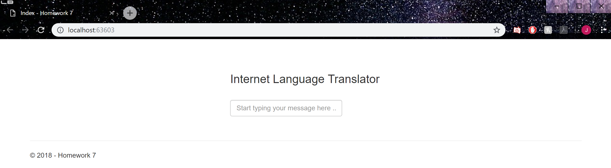

# Homework 7

[Repository](https://github.com/jhammett15/jhammett15.github.io) 

The goal of this project was to create a dynamic, single page application using an external API called Giphy. If you typed in a string into the input bar, every time you typed a space it would translate the word below. If your word was "boring," it would just print the word. If it was "interesting," it would translate it into a gif and print that below instead of the word. The page needed to be responsive-- that is it only reloaded the parts that changed, not the entire page.

## Setup

The setup for this application was very simple. I created a blank MVC project and created one controller and corresponding view. The view had no navbar, just a title, a search bar, and a space below for the output. I also put a razor tag at the bottom called PageScripts (which I defined in the shared layout page) so that it would render my javascript.

```html
<div class="row" style="text-align:center">
    <div class="col" style="display:inline-block">
        <h3>Internet Language Translator</h3>
        <br />
        <input class="form-control" id="Input" type="text" placeholder="Start typing your message here ..." />
    </div>
    <br />
    <br />
    <div class="row">
        <div class="row gifRow" id="gifString">
            <p></p>
        </div>
    </div>
    
</div>

@section PageScripts
{
    <script type="text/javascript" src="~/Scripts/JavaScript.js"></script>    
}
```



After that was done I registered as a developer on Giphy. I created a basic application (that I did nothing with) so they would give me an API key. This key I stored in a file I called giphy.config. I saved this file outside of my repository so it wouldn't get uploaded to github. Inside the file I put this code:

```html
<appSettings>
    <add key="GiphyAPIKey" value="###MY_KEY###" />
</appSettings>
```

I then added a reference to this file in my webconfig file. 

```html
<configuration>
  <appSettings file="C:\Users\Jerika\Documents\cs460\giphy.config">
    <add key="webpages:Version" value="3.0.0.0"/>
    ...
```
## Home Controller

This was the name of the controller I chose for this project. It has two methods in it: an ActionResult method that takes you to the view, and a JsonResult method that takes care of the javascript. 

```c#
public class HomeController : Controller
{
    public ActionResult Index()
    {
        return View();
    }

    public JsonResult GiphySticker(int lastWord)
    {
        string giphyAPIKey = System.Web.Configuration.WebConfigurationManager.AppSettings["GiphyAPIKey"];
        string giphyURL = "https://api.giphy.com/v1/stickers/translate?&api_key=" + giphyAPIKey + "&s=" + lastWord;

        WebRequest request = WebRequest.Create(giphyURL);
        WebResponse response = request.GetResponse();

        Stream giphyStream = response.GetResponseStream();
        var giphyString = new System.Web.Script.Serialization.JavaScriptSerializer().Deserialize<Object>(new StreamReader(giphyStream).ReadToEnd());

        return Json(giphyString, JsonRequestBehavior.AllowGet);


    }
}
```


## Javascript

I've spent a lot of time on this file and haven't quite gotten it to work yet. 

I start out with adding an event listener on the main method that looks for a keypress. The main method defines this keypress as being either the space or the enter key. If either of those is pressed, it runs the spacePressed method.

```javascript
window.addEventListener("keypress", main, false)

function main(e) {
    if (e.keyCode == "32" || e.keyCode == "13") {
       spacePressed();
    }
}
```

I then have the spacePressed method. This method gets the input from the search bar (whose ID is Input), and gets the last word. It then defines the url, which I call giphyLink using the giphy url, my API key, and the word it's to search. It then makes the ajax call, defining the type to be GET, the url to be the one I just built, and the datatype to be json. If it's successful, it calls the buildString method. If it's not successful, it calls the errorOnAjax method.

```javascript
function spacePressed(link) {
    var input = document.getElementById("Input").value;
    var word = input.substr(input.trim().lastIndexOf(" ") + 1);
    giphyLink = "https://api.giphy.com/v1/stickers/translate?&api_key=" + System.Web.Configuration.WebConfigurationManager.AppSettings["GiphyApiKey"] + "&s=" + word;

    $.ajax({
        type: 'GET',
        url: giphyLink,
        dataType: 'json',
        success: buildString,
        error: errorOnAjax
    });
}
```

I then defined the buildString method. It creates a variable called output, which is the area I want the javascript to display on the view. It then builds the string. I defined a "boring" word to be one that was less than six characters. If it was "boring", it was supposed to add the word to the output, and if the word was "interesting", it was supposed to get the gif associated with that word and add THAT to the output.

```javascript
function buildString(word) {
    var output = document.getElementById("gifString");

    if (word.length < 6) {
        output.innerHTML += word + " ";
    }
    else {
        var gif = '<iframe class="giphy-embed" src="' + word.data.embed_url + '" width="100" height="100"';
        output.innerHTML += gif;
    }
}
```

I haven't quite gotten this section to work yet, I just wanted to have something up before it was graded so I could get at least partial credit, even if it's not very much. I'll be continuing to work on this so hopefully I'll get it done before then.


