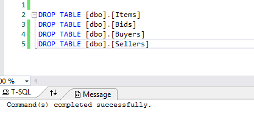

# Homework 8

[Repository](https://github.com/jhammett15/jhammett15.github.io) 

The goal of this project was to be able to create a complex web application from scratch, including a multi-table database that I created, CRUD functionality, and AJAX. The idea for the project was an auction house site. There are four entities, or tables/models: Buyer, Seller, Item, and Bid. We were to write an Up and Down script in T-SQL to create the database with these tables and take them down. For the site itself, we were to follow the Create, Read, Update, Delete (CRUD) functionality and create five pages that would do just that. A home page to act as a landing site, an Item Create page to make bids, an Item Details page (Read) to display all bids on an item, or the entire table in descending order by price. This was to  be done using AJAX. Bids are final and so we were not to allow them to be edited or deleted. We also created an Item Edit page, which allowed us to edit the details of an item but not its ID. Lastly we created an Item Delete page, where we could delete an item. Lastly on the home page we were to have a list that showed the ten most recent bids.

## Create Database

This was a fairly simple part of the project. I created an Up.sql and a Down.sql that created and seeded the tables, and took them down respectively. I made sure to include primary keys for each table and listed the foreign keys where applicable.

```sql
CREATE TABLE [dbo].[Buyers]
(
    [Name]          NVARCHAR(64)                NOT NULL,
    PRIMARY KEY (Name)
);

CREATE TABLE [dbo].[Sellers]
(
    [Name]          NVARCHAR(64)                NOT NULL,
    PRIMARY KEY (Name)
);

CREATE TABLE [dbo].[Items]
(
    [ID]            INT IDENTITY (1000,1)       NOT NULL,
    [Name]          NVARCHAR(64)                NOT NULL,
    [Description]   NVARCHAR(128)               NOT NULL,
    [Seller]        NVARCHAR(64)                NOT NULL,
    CONSTRAINT [PK_dbo.Items] PRIMARY KEY CLUSTERED ([ID] ASC),
    FOREIGN KEY (Seller) REFERENCES Sellers(Name)
);

CREATE TABLE [dbo].[Bids]
(
    [Item]          NVARCHAR(64)                NOT NULL,
    [Buyer]         NVARCHAR(64)                NOT NULL,
    [Price]         DECIMAL(10,2)               NOT NULL,
    [Timestamp]     DATETIME                    NOT NULL    DEFAULT SYSUTCDATETIME(),
    PRIMARY KEY (Timestamp),
    FOREIGN KEY (Buyer) REFERENCES Buyers(Name)
);

INSERT INTO [dbo].[Buyers] (Name) VALUES
    ('Jane Stone'),
    ('Tom McMasters'),
    ('Otto Vanderwall');
    
INSERT INTO [dbo].[Sellers] (Name) VALUES
    ('Gayle Hardy'),
    ('Lyle Banks'),
    ('Pearl Greene');
    
INSERT INTO [dbo].[Items] (Name, Description, Seller) VALUES
    ('Abraham Lincoln Hammer', 'A bench mallet fashioned from a broken rail-splitting maul in 1829 and owned by Abraham Lincoln', 'Pearl Greene'),
    ('Albert Einsteins Telescope', 'A brass telescope owned by Albert Einstein in Germany, circa 1927', 'Gayle Hardy'),
    ('Bob Dylan Love Poems', 'Five versions of an original unpublished, handwritten, love poem by Bob Dylan', 'Lyle Banks');
    
INSERT INTO [dbo].[Bids] (Item, Buyer, Price, Timestamp) VALUES
    (1001, 'Otto Vanderwall', 250000, '12/04/2017 09:04:22'),
    (1003, 'Jane Stone', 95000, '12/04/2017 08:44:03');
    
GO
```

```sql

DROP TABLE [dbo].[Items];
DROP TABLE [dbo].[Bids];
DROP TABLE [dbo].[Buyers];
DROP TABLE [dbo].[Sellers];
```

To create the database I went into the SQL Server Object Explorer and right-clicked the Databases folder in localdb. I gave it a name and selected the location of my App_Data folder. I then right-clicked the App_Data folder in my project and clicked add existing file. I navigated to the App_Data folder again and selected the .mdf and .ldf files for the database. I was then able to connect my up and down scripts to the database and run them.

>>>>>>> f96562cf28b8e5737be3194e246372017ede5e38




## Create Models

Once the database was up and running I could reverse engineer the models from it. Before I could do this I had to go download Entity Framework into my project via the Nuget package manager. I right-clicked the Models folder and selected add new item. This item was of type ADO.NET Entity Data Model and I called it AuctionContext. I moved it to the DAL folder and moved on.

## CRUD Functionality

There were five basic parts to the CRUD functionality: a list page, a Create page, a Details page, an Edit page, and a Delete page.

DON'T forget to create an instance of the context class.

Here's the code from the controller for the list page:
```c#
public ActionResult ItemList()
{
    return View(db.Items.ToList());
}
```
The only thing I needed to edit on the autogenerated View was the Actionlinks at the bottom, so they would point to my pages. Since it's autogenerated I will omit that code.

Here's the code from the controller for the Create page:
```c#
[HttpGet]
public ActionResult ItemCreate()
{
    List<string> names = new List<string>();

    foreach(Seller i in db.Sellers)
    {
        names.Add(i.Name);
    }

    ViewBag.names = names;

    var item = db.Items;
    return View();
}

[HttpPost]
public ActionResult ItemCreate([Bind(Include = "Name, Description, Seller")]Item item)
{
    if(ModelState.IsValid)
    {
        db.Items.Add(item);
        db.SaveChanges();
        return RedirectToAction("ItemCreate");
    }

    return View(item);
}
```

Here's the code from its View:
```html
<div class="form-horizontal">
    <h4>Item</h4>
    <hr />
    @Html.ValidationSummary(true, "", new { @class = "text-danger" })
    <div class="form-group">
        @Html.LabelFor(model => model.Name, htmlAttributes: new { @class = "control-label col-md-2" })
        <div class="col-md-10">
            @Html.EditorFor(model => model.Name, new { htmlAttributes = new { @class = "form-control" } })
            @Html.ValidationMessageFor(model => model.Name, "", new { @class = "text-danger" })
        </div>
    </div>

    <div class="form-group">
        @Html.LabelFor(model => model.Description, htmlAttributes: new { @class = "control-label col-md-2" })
        <div class="col-md-10">
            @Html.EditorFor(model => model.Description, new { htmlAttributes = new { @class = "form-control" } })
            @Html.ValidationMessageFor(model => model.Description, "", new { @class = "text-danger" })
        </div>
    </div>

    <div class="form-group">
        @Html.LabelFor(model => model.Seller, "Seller", htmlAttributes: new { @class = "control-label col-md-2" })
        <div class="col-md-10">
            @Html.DropDownList("Seller", new SelectList(ViewBag.names, "Name"), "Sellers", htmlAttributes: new { @class = "form-control" })
            @Html.ValidationMessageFor(model => model.Seller, "", new { @class = "text-danger" })
        </div>
    </div>

<div class="form-group">
    <div class="col-md-offset-2 col-md-10">
        <input type="submit" value="Create" class="btn btn-default" />
    </div>
    </div>
 </div>
}
```

The hardest part of this was creating the dropdown menu. I got the seller names in the HttpGET method, shoved them in a ViewBag, and used the ViewBag in the View.

Here's the code from the controller for the Details page:
```c#
[HttpGet]
public ActionResult ItemDetails(int id)
{
    var details = db.Items.Where(i => i.ID == id).FirstOrDefault();
    return View(details);
}
```

All code for the View is autogenerated. So long as you remember to change the ActionLink on the List page there will be no problems with this.

Here's the code for the Edit page:
```c#
[HttpGet]
public ActionResult ItemEdit(int id)
{
    var details = db.Items.Where(i => i.ID == id).FirstOrDefault();
    return View(details);
}

[HttpPost]
public ActionResult ItemEdit(int id, FormCollection collection)
{
    try
    {
        var itemToUpdate = db.Items.Find(id);

        itemToUpdate.Name = collection["Name"];
        itemToUpdate.Description = collection["Description"];

        db.SaveChanges();

        return RedirectToAction("ItemList");

    }
    catch
    {
        return View();
    }
}
``` 
I never quite got this to work because I couldn't figure out how to update the dropdown menu. The only thing edited in the View was the dropdown menu. You can see an example of that above.

Here's the code for the controller for the Delete page:

```c#
[HttpGet]
public ActionResult ItemDelete(int id)
{
    var details = db.Items.Where(i => i.ID == id).FirstOrDefault();
    return View(details);
}

[HttpPost]
public ActionResult ItemDelete(int id, FormCollection collection)
{
    try
    {
        db.Items.Remove(db.Items.Find(id));
        db.SaveChanges();

        return RedirectToAction("ItemList");
    }
    catch
    {
        return View();
    }
}
```

The code for the View ws all autogenerated.

## Create a Bid

Adding the link for the Create Bid to the navbar was simple. Here's the code I used for the button on the home page:
```c#
@Html.ActionLink("Create a Bid!", "CreateBid", "Home", new { area="" })
```

Here's the controller code for the CreateBid page
```c#
[HttpGet]
public ActionResult CreateBid()
{
    List<string> buyers = new List<string>();

    foreach (Buyer i in db.Buyers)
    {
        buyers.Add(i.Name);
    }

    ViewBag.buyers = buyers;

    return View();
}

[HttpPost]
public ActionResult CreateBid([Bind(Include = "Item, Buyer, Price")]Bid bid)
{
    if (ModelState.IsValid)
    {
        db.Bids.Add(bid);
        db.SaveChanges();
        return RedirectToAction("CreateBid");
    }

    return View(bid);
}
```

Again the View was entirely autogenerated.

## Display Bids

The first thing I did was give the javascript an area to appear on the Details View:
```html
<div class="row">
    <div class="col" id="ajaxArea">
        <p></p>
    </div>
</div>
```

I also added a Razor line at the bottom of the page so it would render my javascript
```c#
@section PageScripts
{
    <script type="text/javascript" src="~/Scripts/JavaScript.js"></script>
}
```

I also put the corresponding line in the shared layout page defining PageScripts
```c#
@RenderSection("PageScripts", required: false)
```

