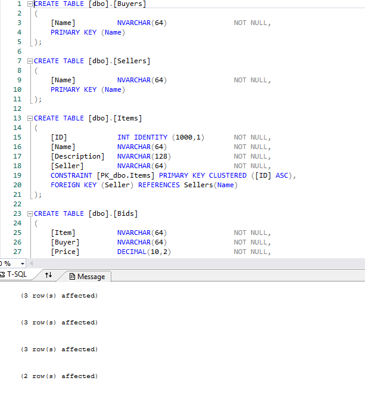

# Homework 8

[Repository](https://github.com/jhammett15/jhammett15.github.io) 

The goal of this project was to be able to create a complex web application from scratch, including a multi-table database that I created, CRUD functionality, and AJAX. The idea for the project was an auction house site. There are four entities, or tables/models: Buyer, Seller, Item, and Bid. We were to write an Up and Down script in T-SQL to create the database with these tables and take them down. For the site itself, we were to follow the Create, Read, Update, Delete (CRUD) functionality and create five pages that would do just that. A home page to act as a landing site, an Item Create page to make bids, an Item Details page (Read) to display all bids on an item, or the entire table in descending order by price. This was to  be done using AJAX. Bids are final and so we were not to allow them to be edited or deleted. We also created an Item Edit page, which allowed us to edit the details of an item but not its ID. Lastly we created an Item Delete page, where we could delete an item. Lastly on the home page we were to have a list that showed the ten most recent bids.

## Create Database

This was a fairly simple part of the project. I created an Up.sql and a Down.sql that created and seeded the tables, and took them down respectively. I made sure to include primary keys for each table and listed the foreign keys where applicable.

```sql
CREATE TABLE [dbo].[Buyers]
(
    [Name]          NVARCHAR(64)                NOT NULL,
    PRIMARY KEY (Name)
);

CREATE TABLE [dbo].[Sellers]
(
    [Name]          NVARCHAR(64)                NOT NULL,
    PRIMARY KEY (Name)
);

CREATE TABLE [dbo].[Items]
(
    [ID]            INT IDENTITY (1000,1)       NOT NULL,
    [Name]          NVARCHAR(64)                NOT NULL,
    [Description]   NVARCHAR(128)               NOT NULL,
    [Seller]        NVARCHAR(64)                NOT NULL,
    CONSTRAINT [PK_dbo.Items] PRIMARY KEY CLUSTERED ([ID] ASC),
    FOREIGN KEY (Seller) REFERENCES Sellers(Name)
);

CREATE TABLE [dbo].[Bids]
(
    [Item]          NVARCHAR(64)                NOT NULL,
    [Buyer]         NVARCHAR(64)                NOT NULL,
    [Price]         DECIMAL(10,2)               NOT NULL,
    [Timestamp]     DATETIME                    NOT NULL    DEFAULT SYSUTCDATETIME(),
    PRIMARY KEY (Timestamp),
    FOREIGN KEY (Buyer) REFERENCES Buyers(Name)
);

INSERT INTO [dbo].[Buyers] (Name) VALUES
    ('Jane Stone'),
    ('Tom McMasters'),
    ('Otto Vanderwall');
    
INSERT INTO [dbo].[Sellers] (Name) VALUES
    ('Gayle Hardy'),
    ('Lyle Banks'),
    ('Pearl Greene');
    
INSERT INTO [dbo].[Items] (Name, Description, Seller) VALUES
    ('Abraham Lincoln Hammer', 'A bench mallet fashioned from a broken rail-splitting maul in 1829 and owned by Abraham Lincoln', 'Pearl Greene'),
    ('Albert Einsteins Telescope', 'A brass telescope owned by Albert Einstein in Germany, circa 1927', 'Gayle Hardy'),
    ('Bob Dylan Love Poems', 'Five versions of an original unpublished, handwritten, love poem by Bob Dylan', 'Lyle Banks');
    
INSERT INTO [dbo].[Bids] (Item, Buyer, Price, Timestamp) VALUES
    (1001, 'Otto Vanderwall', 250000, '12/04/2017 09:04:22'),
    (1003, 'Jane Stone', 95000, '12/04/2017 08:44:03');
    
GO
```

```sql
DROP TABLE [dbo].[Buyers];
DROP TABLE [dbo].[Sellers];
DROP TABLE [dbo].[Items];
DROP TABLE [dbo].[Bids];
```

To create the database I went into the SQL Server Object explorer and right-clicked the Databases folder in localdb. I gave it a name and selected the location to by my App_data folder. I then right-clicked on the App_Data folder and clicked add existing item. I navigated to the App_data folder and selected the mdf and ldf files. I was then able to connect my up and down scripts to the database and run them. 



## Create Models

Once the database was up and running I could reverse engineer the models from it. Before I could do this I had to go download Entity Framework into my project via the Nuget package manager. I right-clicked the Models folder and selected add new item. This item was of type ADO.NET Entity Data Model