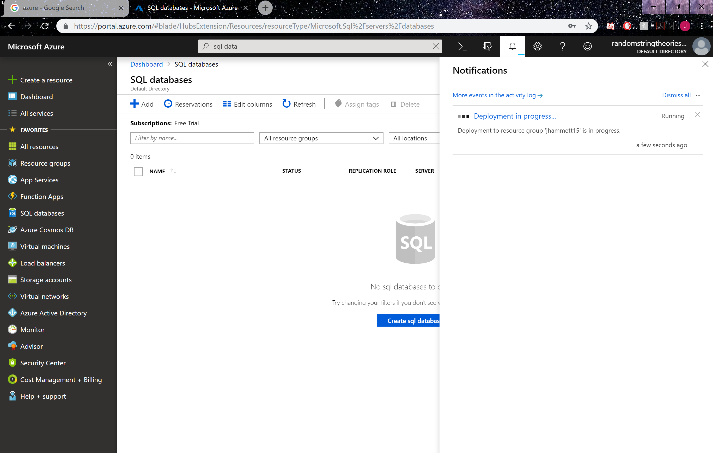
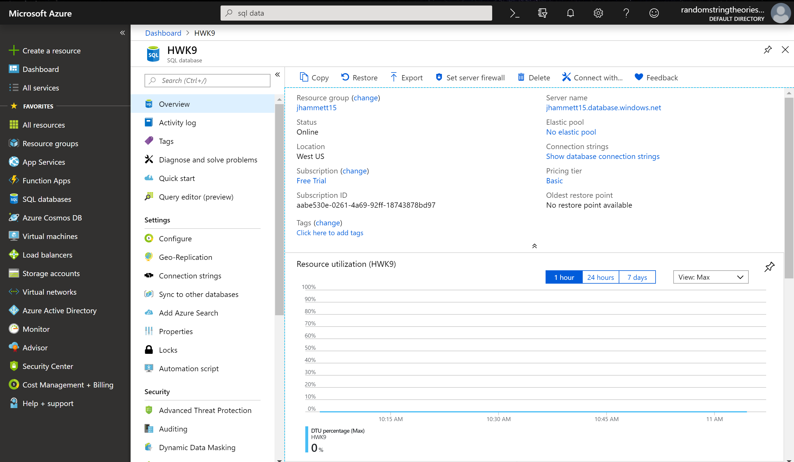
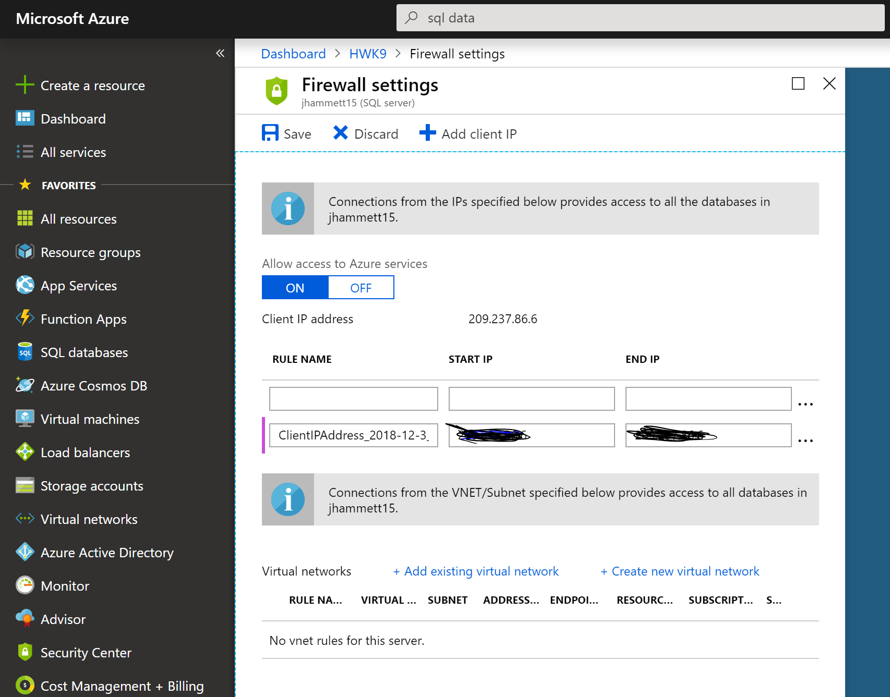
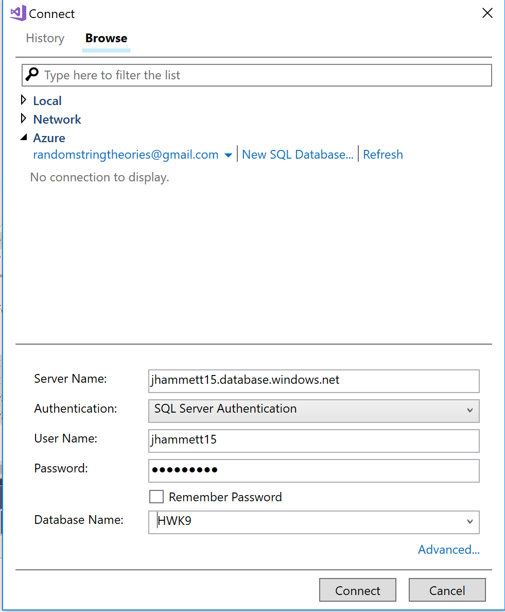
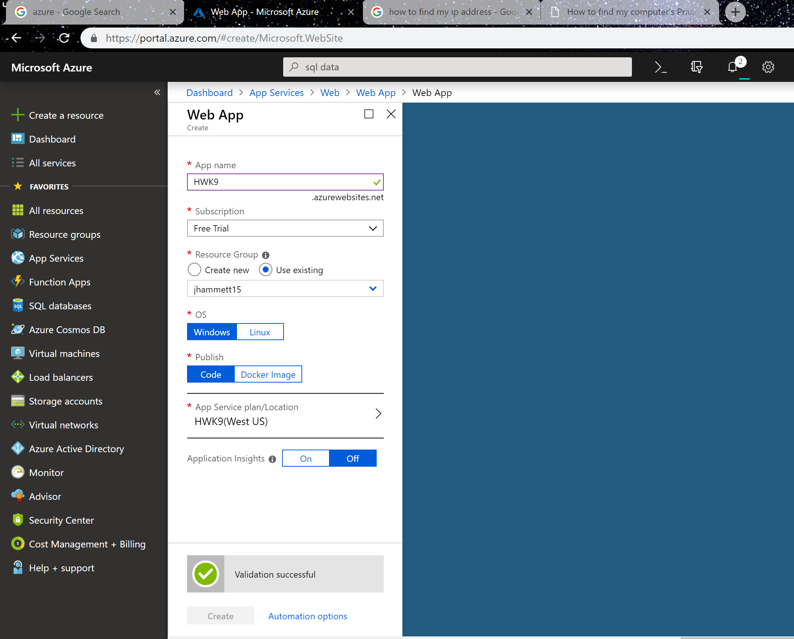
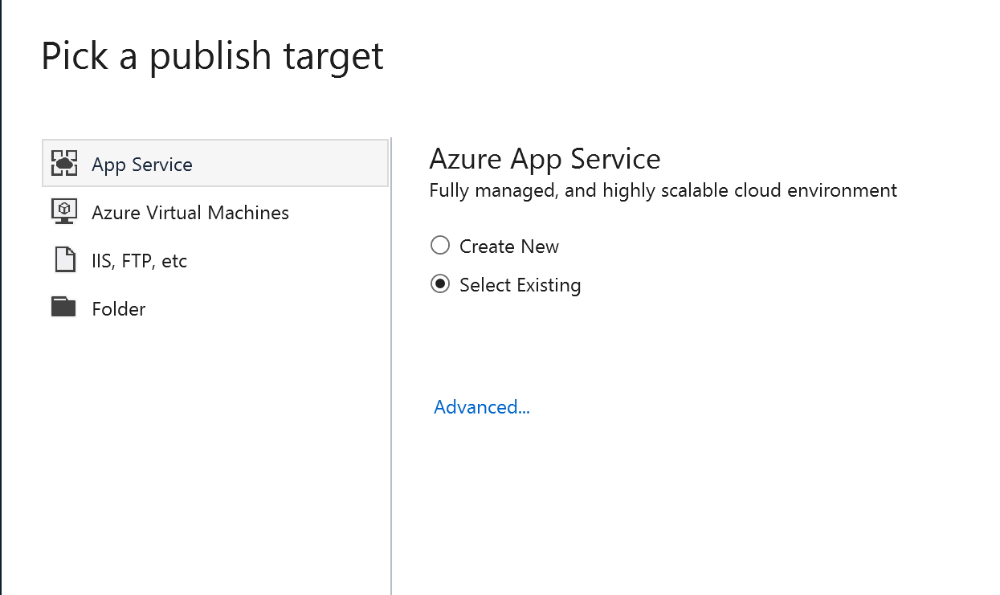
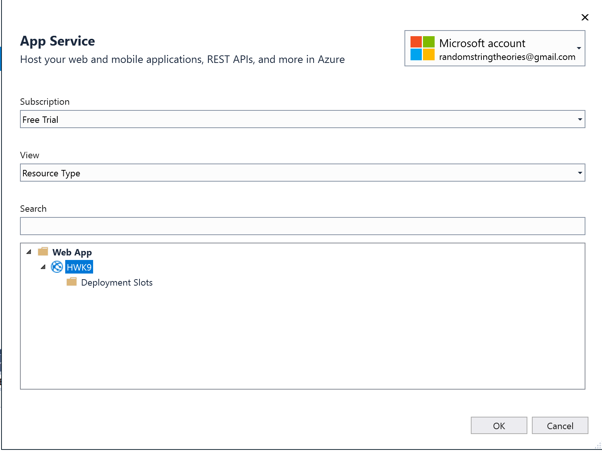
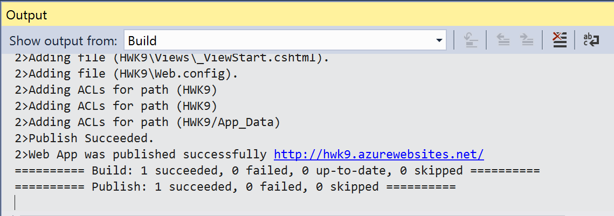
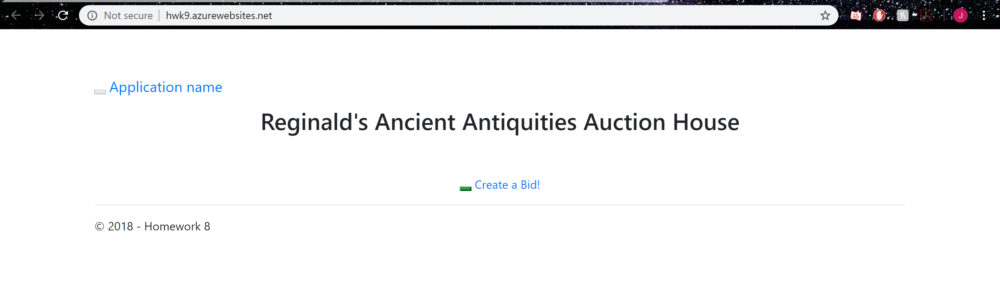
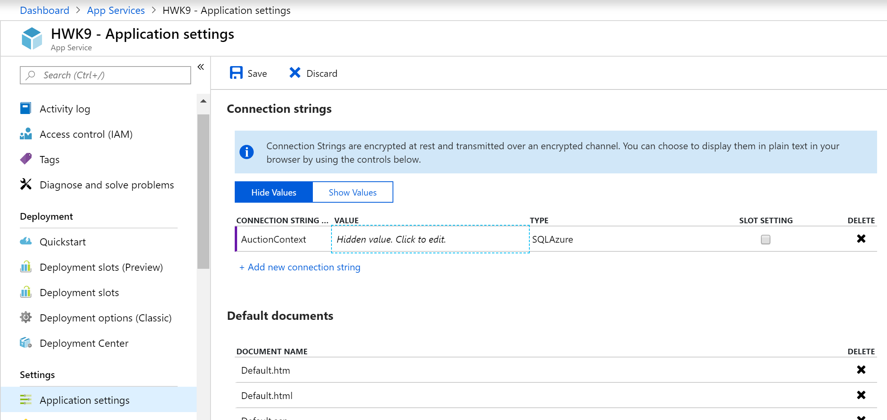

# Homework 8

[Repository](https://github.com/jhammett15/jhammett15.github.io) 

The goal for this project was just to take our Homework 8 and deploy it to Azure.

## Creating Database
The first step was to create the database remotely on Azure. 
I first created an account, then I created a resource group and a database.

I then set up a firewall rule exception. To do that I went into my database

copied the server name, clicked set server firewall, clicked Add client IP, and put in my IP address, which should be auto generated by Azure. 

This allows my computer through Azure's firewall so I can access the database.

Then in Visual Studios, we can add the database through the Server Explorer.
First you click the Add SQL Server button, put in the name of my server, the address of which can be found in the info at the top of my database page, put in my login information, and set the database name to what I called my database.

Once that's done, in Visual Studios you open up your Up script, set the connection to be the one you just created under Azure, and create the tables.

## Creating the Website

Then you go into Azure's App Services and click Add, select Web App, and fill out the form that comes up. Use the free trial and your existing resource group. Make sure to create a new Service plan and select the free one under the Dev/Test menu. This will create the website your homework will publish to.

## Publish to Azure

Now that everything is set up, we need to publish our local project to Azure.
In Visual Studios, right click on the project in the Solution Explorere and click publish.

Pick the target to be Microsoft Azure's App service and click the select existing radio button. Then click publish.

Keep the free trial, select Resource Type for the View and select the Web App we just created.

Then just wait for it to publish

Once it is published and deployed to Azure, go to SQL databases on the Azure portal, click the name of the database to open its dashboard, and click the Show Database Connection Strings link at the top of the page. 

Copy the string, go to app services, and click on the project name. Go to the application settings page and in the Connection Strings section add a new one. Set the name to be the name of your context class in your local project, and copy the connection string from the previous page there, replacing {yourusername} and {yourpassword} with the admin username and password.

Your project is now viewable. You can see the URL under the app services dashboard for your database.